# Stereo Vision
**Objective:** Implement stereo vision algorithms to compute pixel disparity in images.

## Key Steps:

  * **Block Matching:**

    1. Slide a window across the left image row, comparing pixels to the right image row.

    2. Calculate disparity using the Sum of Absolute Differences (SAD) and the Sum of Squared Differences (SSD).

    3. Repeat for window sizes 1, 5, and 9, generating 6 disparity maps.
   
    **Results**
    

    
    

    

        <em>Disparity map for the 1st image using SAD cost and window sizes 1, 5, 9</em>
    

    

        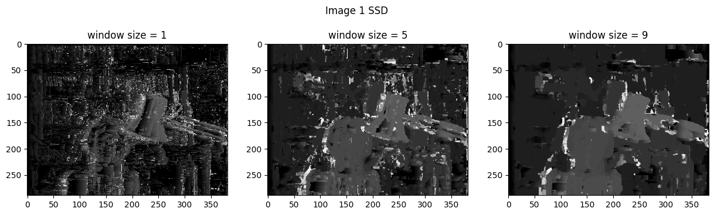
    

    

        <em>Disparity map for the 1st image using SSD cost and window sizes 1, 5, 9</em>
    

    

        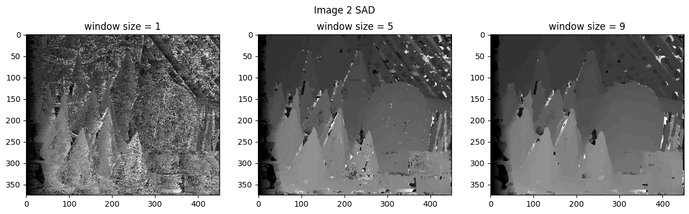
    

    

        <em>Disparity map for the 2nd image using SAD cost and window sizes 1, 5, 9</em>
    

    

        
    

    

        <em>Disparity map for the 2nd image using SSD cost and window sizes 1, 5, 9</em>
    

    

        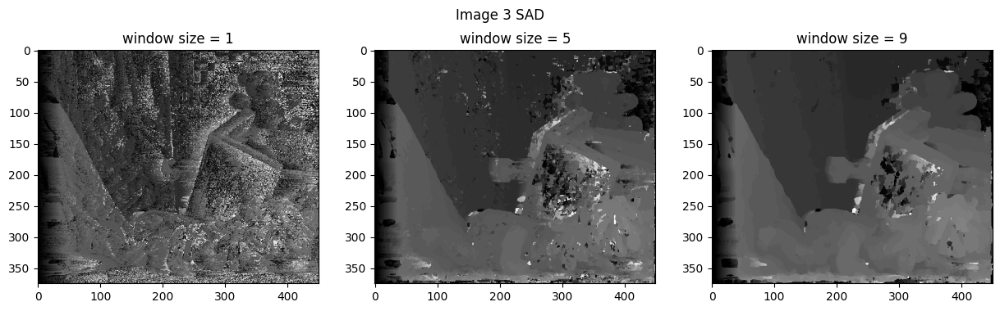
    

    

        <em>Disparity map for the 3rd image using SAD cost and window sizes 1, 5, 9</em>
    

    

        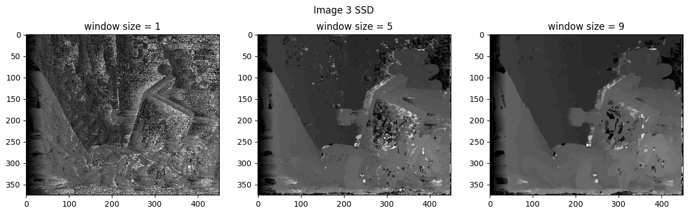
    

    

        <em>Disparity map for the 3rd image using SSD cost and window sizes 1, 5, 9</em>
    

     
   
* **Dynamic Programming:**

  1. Calculate the minimum cost path for matching left and right image scanlines using dynamic programming.

  2. Use squared error and constant penalty for skipped pixels.

  3. Find disparity maps.

  4. Backtrack to recover the pixel alignment path.

  5. Visualizing the alignment path for a single scanline using vertical, horizontal, and diagonal lines.
 
  **Results**

  

    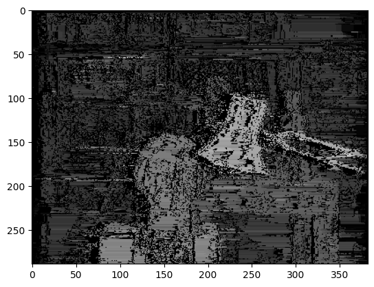
    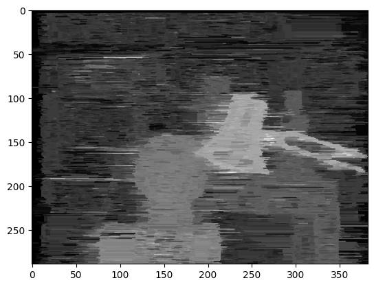
  

  

        <em>Disparity map for the 1st image using dynamic programming with and without filling gaps</em>
  

  

    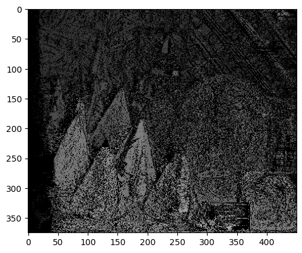
    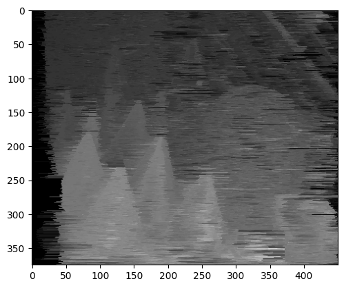
  

  

        <em>Disparity map for the 2nd image using dynamic programming with and without filling gaps</em>
  

  

    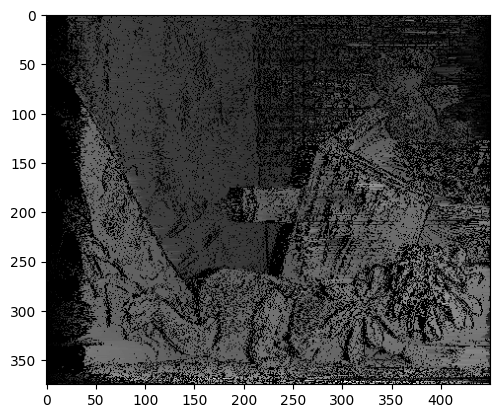
    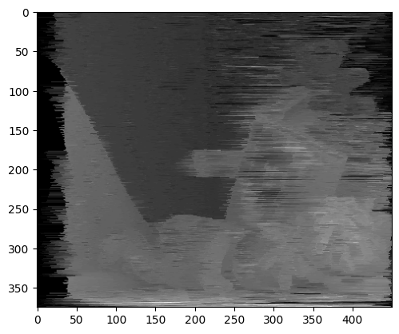
  

  

        <em>Disparity map for the 3rd image using dynamic programming with and without filling gaps</em>
  

  

    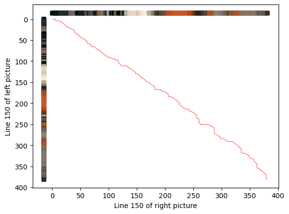
  

  

        <em>Alignment path for a single scanline in the 1th image</em>
  

  
  

    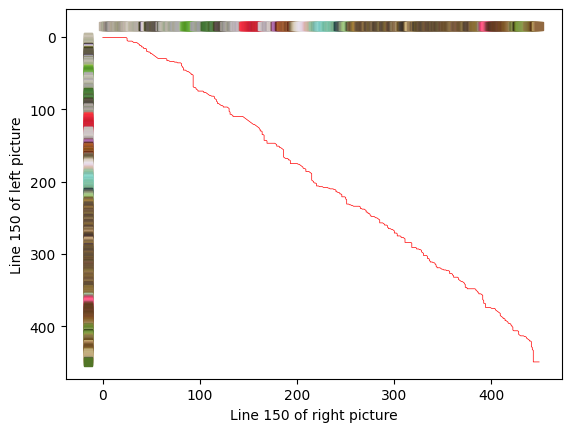
  

  

        <em>Alignment path for a single scanline in the 2nd image</em>
  

  
  

    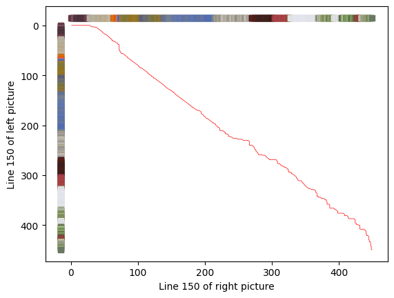
  

  

        <em>Alignment path for a single scanline in the 3rd image</em>
  

